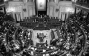
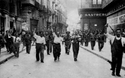
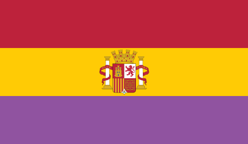
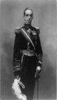
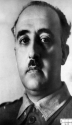

# Guerra Civil Española

## Features

Overhaul of Spain to improve gameplay and historical accuracy during the Spanish Civil War in [Hearts of Iron IV](https://hoi4.paradoxwikis.com/Hearts_of_Iron_4_Wiki).

### Scenarios

#### The Birth of the Second Republic - September 12, 1931

The Spanish Constitution of 1931 is signed. King Alfonso XIII has abdicated and fled to France. Manuel Azaña Díaz has been given control of a minority government with the desperate goal of securing the fledging Republic.

#### A House of Cards - January 1, 1936

The 1936 elections are a month and a half away. Manuel Azaña Díaz still holds the reigns of power but only just. Leftist populism is at a fever pitch and the military is considering their own intervention.

### Interface

Topical loadscreen [images](images/loadscreen-images/README.md) and [quotes](shared/spanish-civil-war-quotes.md).

#### Historical Flags and Leaders

Although [Partido Comunista de España](https://en.wikipedia.org/wiki/Communist_Party_of_Spain) was the largest faction of the [Popular Front](https://en.wikipedia.org/wiki/Popular_Front_(Spain)), the Partido Obrero de Unificación Marxista (POUM) is the Communist faction in this mod. This is both a historical and aesthetic decision. POUM was responsible for more military action than the PCE, and POUM forces included extreme leftist factions such as anarchist fighters from the [Confederación Nacional del Trabajo](https://en.wikipedia.org/wiki/Confederaci%C3%B3n_Nacional_del_Trabajo#The_Civil_War). POUM divisions were attacked repeatedly by temporary coalitions of PCE and Falangist forces.

 Republican | Non-Aligned | Communist | Facist
 :--:|:--:|:--:|:--:
  |  |  |  |
 [Second Spanish Republic](https://en.wikipedia.org/wiki/Second_Spanish_Republic) | [Carlist Party](https://en.wikipedia.org/wiki/Carlism) | [Workers' Party of Marxist Unification](https://en.wikipedia.org/wiki/POUM) | [Spanish Phalanx of the Councils of the National-Syndicalist Offensive](https://en.wikipedia.org/wiki/Falange_Espa%C3%B1ola_de_las_JONS)
  |  |  | 
[Manuel Azaña](https://en.wikipedia.org/wiki/Manuel_Aza%C3%B1a) | [King Alfonso XIII](https://en.wikipedia.org/wiki/Alfonso_XIII_of_Spain) | [Andrés Nin Pérez](https://en.wikipedia.org/wiki/Andr%C3%A9s_Nin_P%C3%A9rez) | [Francisco Franco](https://en.wikipedia.org/wiki/Francisco_Franco)
 
### Gameplay
  
* [Generic National Focus Tree](https://hoi4.paradoxwikis.com/Generic_national_focus_tree) replaced with historic events:
  * Empower Anarchists to radically increase Communist support at the expense of factory output.
  * Optimize the Francoist military-industrial complex to launch an offensive war upon victory in Spain.
  * Supress dissent to trade manpower for National Unity as either the Facist or Communist government.
  * Reignite [pennisular war](https://en.wikipedia.org/wiki/Peninsular_War) goals against Portugal regardless of allegiance.
  * Choose the third option: Stage a democratic uprising after the Civil War.
* World War II participation is historical, joining a belligerent faction results in a declaration of war and invasion.
* War continues until you secure control of the state.
* Historical national advisors:
  * [Manuel Hedilla](https://en.wikipedia.org/wiki/Manuel_Hedilla): Increases Facist support, decreases national unity.
  * [Lluís Companys](https://en.wikipedia.org/wiki/Llu%C3%ADs_Companys): More radically increases democratic support, but executed and removed after the war.
  
> Raise an [issue](https://github.com/kghamilton89/guerra-civil-espanola/issues/new) to report crashes or bugs.

## Download Instructions

Store `.mod` files in the applicable directory:

* Windows: `C:\Users\<Username>\Documents\Paradox Interactive\Hearts of Iron IV\mod`
* Mac OS: `~/Documents/Paradox Interactive/Hearts of Iron IV/mod`
* Linux: `~/.local/share/Paradox Interactive/Hearts of Iron IV/mod`

If you do not have a `/mod` or `\mod` directory at the appropriate location, you need to create one.

On the **Mods** tab, click **Mod Tools**, then **Create New Mod**. Name the mod **Guerra Civil Española** and create a subdirectory named `guerra-civil-espanola`.

Clone `guerra-civil-espanola` repository into the defined directory. Select **Guerra Civil Española** on the **Mods** tab when you launch Hearts of Iron IV.

No Steam subscription is available yet, this mod is still in development.

> Note that if you select the **Clear User Directory** option upon program crash, `.mod` files are deleted and need to be re-uploaded to the `/mod` or `\mod` directory.
