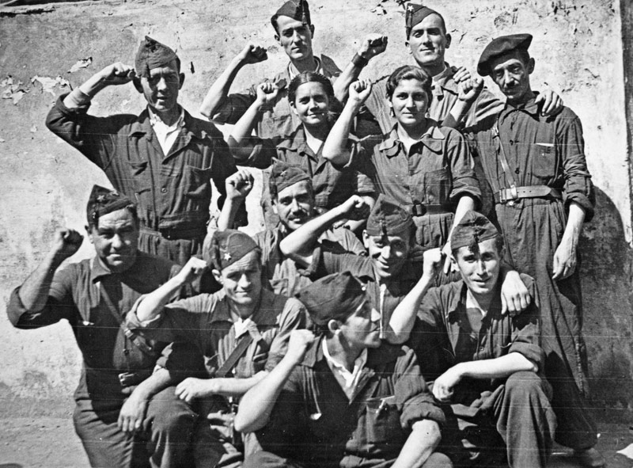

# Guerra Civil Española

Full overhaul of Spain to improve gameplay and historical accuracy during the Spanish Civil War. Raise an issue to notify about bugs.

* Generic National Focus Tree replaced with historic.
* Support for Democratic Republicans.
* AI never joins the Axis/Comintern.
* Civil War balance improved to extend the fighting until 1939.

## Download Instructions

Store mod files in the correct directory:

* Windows: `C:\Users\<Username>\Documents\Paradox Interactive\Hearts of Iron IV\mod`
* Mac OS: `~/Documents/Paradox Interactive/Hearts of Iron IV/mod`
* Linux: `~/.local/share/Paradox Interactive/Hearts of Iron IV/mod`

If you do not have a `/mod` directory at the appropriate location, you need to create one.

Clone `guerra-civil-espanola` repository into `/mod` directory. Select **Guerra Civil Española** on the **Mods** tab when you launch Hearts of Iron 4.

No Steam subscription is available yet, this mod is still in development.
